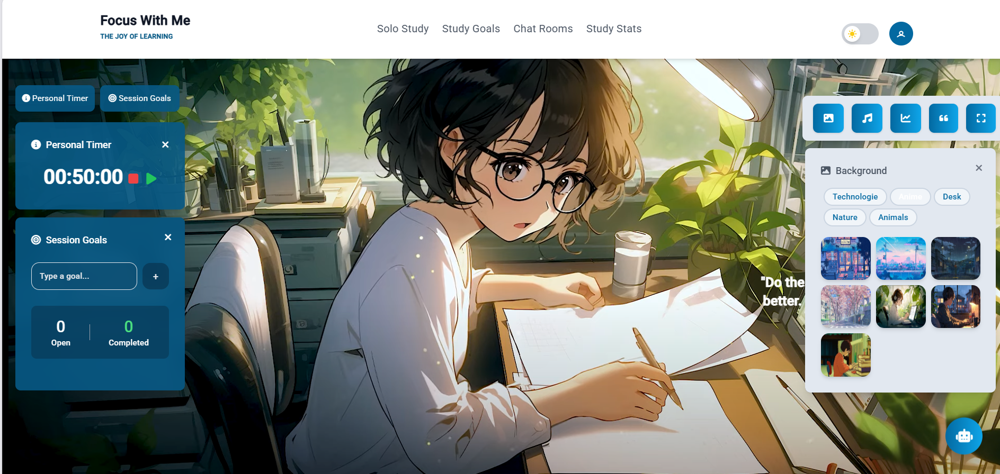
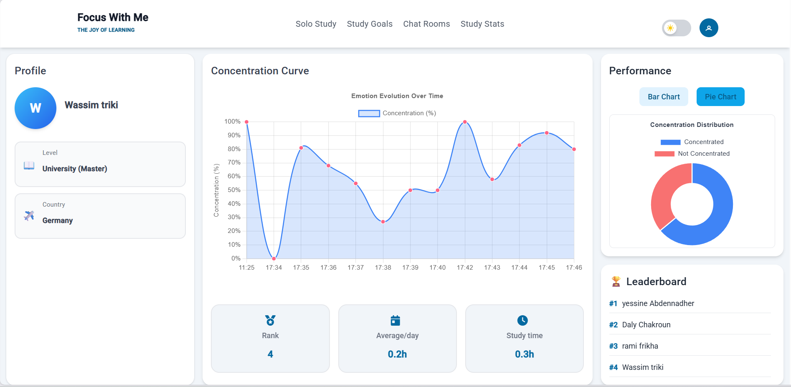
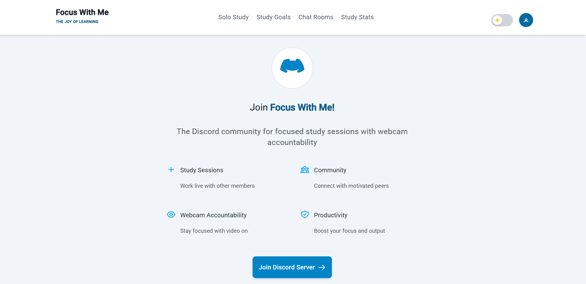

# 🎯 Focus With Me

> **Focus With Me** est une application web qui aide les étudiants et professionnels à **améliorer leur concentration** grâce à une analyse intelligente en temps réel et à un tableau de bord interactif.

---

## 🚀 Aperçu du projet

L’application utilise la **vision par ordinateur** et l’**intelligence artificielle** pour **analyser le niveau de concentration** des utilisateurs à partir de la caméra.
Elle fournit un **tableau de bord web** qui affiche des statistiques claires sur l’évolution de la concentration au fil du temps.

---

## ✨ Fonctionnalités principales

* 🔍 **Analyse de concentration en temps réel**

  * Détection des comportements liés à la baisse d’attention : perte de focus, distractions.

* 📊 **Tableau de bord web**

  * Graphiques et courbes représentant l’évolution du niveau de concentration.

* 🤝 **Coworking virtuel**

  * Possibilité de rejoindre un espace virtuel pour travailler avec d’autres utilisateurs.

* 🤖 **Assistant intelligent**

  * Conseils personnalisés basés sur les données de concentration.

---

## 🖼️ Captures d’écran

| Page d’accueil                   | Dashboard                               | Analyse en direct                    |
| -------------------------------- | --------------------------------------- | ------------------------------------ |
|  |  |  |

---

## 🎥 Démo vidéo

👉 [Regarder la démonstration sur YouTube](https://youtu.be/bvN-e8MNvKE)

*(mets ici ton vrai lien vidéo)*

---

## 🛠️ Technologies utilisées

* **Frontend** : Angular, TailwindCSS
* **Backend** : Python (FastAPI)
* **IA / Vision par ordinateur** : PyTorch, OpenCV (détection du niveau de concentration)
* **Base de données** : Mongodb
* **Autres** : Chart.js / Recharts pour les statistiques

---

## ⚙️ Installation & exécution

### Cloner le projet

```bash
git clone https://github.com/ton-compte/focus-with-me.git
cd focus-with-me
```

### Installer et lancer le frontend

```bash
cd frontend
npm install
ng serve
```

### Installer et lancer le backend

```bash
cd backend
pip install -r requirements.txt
uvicorn main:app --reload
```

---

## 📊 Améliorations futures

* Gamification avec points et badges.
* Intégration de calendrier (Google Calendar, Outlook).
* Optimisation de la précision du modèle de détection de concentration.
* Version responsive mobile.

---

## 👨‍💻 Auteur

Développé par **Yassine Abdennadher**

* 📧 Email : [yassineabdennadher22@gmail.com](yassineabdennadher22@gmail.com)
* 💼 [LinkedIn] ([https://www.linkedin.com/in/ton-profil](https://www.linkedin.com/feed/))


